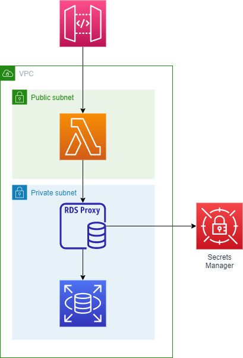

# RDS Proxy for SQL Server with AWS Lambda

The recent release of [RDS Proxy for SQL Server](https://aws.amazon.com/about-aws/whats-new/2022/09/amazon-rds-proxy-rds-sql-server/) opens up a new, powerful set of possibilities for running .NET applications on AWS Lambda.

As a default, AWS Lambda allows up to 1000 concurrent executions. If you are running an application using SQL Server these 1000 concurrent executions will create 1000 seperate SQL connections, this can quickly exhaust the connection pool of your database.

Also, RDS for SQL Server does not support IAM based authentication. This means for applications using SQL server connection strings need to be managed and credentials stored somewhere, ordinarily either SSM Parameter Store or Secrets Manageer.

RDS Proxy solves these two challenges. First, connections are pooled within the proxy. Meaning as Lambda scales connections to the underlying database can be re-used. Secondly, RDS Proxy supports IAM based authentication. This enables us to authenticate our application using IAM roles and policies.



## Prerequisites

- .NET 6
- AWS SAM
- AWS CDK

## Deployment

Deploying the code sample requires three seperate steps:

### Deploy CDK

The network and RDS SQL Server database are deployed using the AWS Cloud Development Kit (CDK). To deploy the CDK code:

1. Navigate to src/infrastructure
2. Run **'cdk bootstrap'** to ensure your AWS account has been bootstrapped with the CDK resources
``` bash
cdk bootstrap
```
3. Run **'cdk deploy'** to deploy the resources
``` bash
cdk deploy
```

It will take a few minutes to deploy the RDS resources.

### Create RDS Proxy

At this moment in time, CloudFormation does not support Proxies for SQL Server. The Proxy needs to be created manually:

1. Navigate to the [RDS Console](https://console.aws.amazon.com/rds/home)
2. In the left hand navigation, select Proxies
3. Click Create proxy
4. In the creation wizard, set the following options:
    - Engine family - SQL Server
    - Proxy identifier - A name of your choice
    - Require Transport Level Security - true (required for IAM auth)
    - Database - Select the RDS instance, it will be named *infrastructurestack-productsdb-**
    - Secrets manager secrets - Select the created secret, it's name will contain *infrastructurestack*
    - Create a new IAM Role
    - IAM authentication - Allowed
    - Subnets - Select the two subnets the RDS instance has been deployed into. *To find this information navigate to the RDS home page, go to databases and select the database that contains the name infrastructurestack-productsdb. In connectivity tab you will see the subnet ids*.
    - VPC security group - Select the security group that contains **InfrastructureStack-productssb**
5. Wait for the RDS proxy to deploy, this may take a few minutes
6. Note down the Proxy ARN and the proxy endpoint

### Deploy function code

Once the RDS proxy is created, you can deploy the application code

1. Navigate to the repo root
2. Run **sam build**

```bash
sam build
```
3. Run **sam deploy** passing in the parameter overrides. Details for each parameter can be found in the below SAM Parameter Values section

```bash
sam deploy --guided --parameter-overrides ParameterKey=ProxyArn,ParameterValue={PROXY_ARN} ParameterKey=LambdaSubnetIds,ParameterValue={LAMBDA_SUBNETS} ParameterKey=LambdaSecurityGroupIds,ParameterValue={LAMBDA_SECURITYGROUP} ParameterKey=ProxyEndpoint,ParameterValue={PROXY_ENDPOINT}
```

### SAM Parameter Values

**{PROXY_ARN}** = The ARN of the RDS proxy, with a couple of changes.
```
arn:aws:rds:us-east-2:521936459218:db-proxy:prx-0c7be4da751905dac
arn:aws:rds-db:us-east-2:521936459218:dbuser:prx-0c7be4da751905dac/*
```
**{PROXY_ENDPOINT}** = The endpoint of the RDS proxy
**{LAMBDA_SUBNETS}** = The subnet Id's to deploy Lambda into. Use the **public subnets** that were deployed with the CDK stack
**{LAMBDA_SECURITYGROUP}** = The security group Id to deploy Lambda into. For ease, use the same security group the RDS instance has been deployed into
